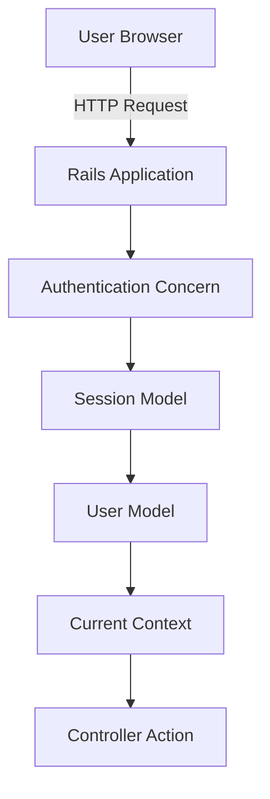
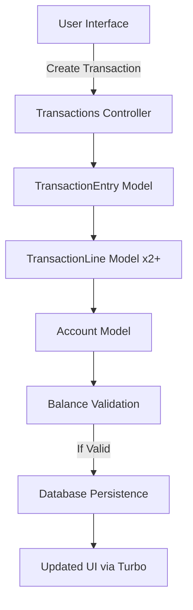
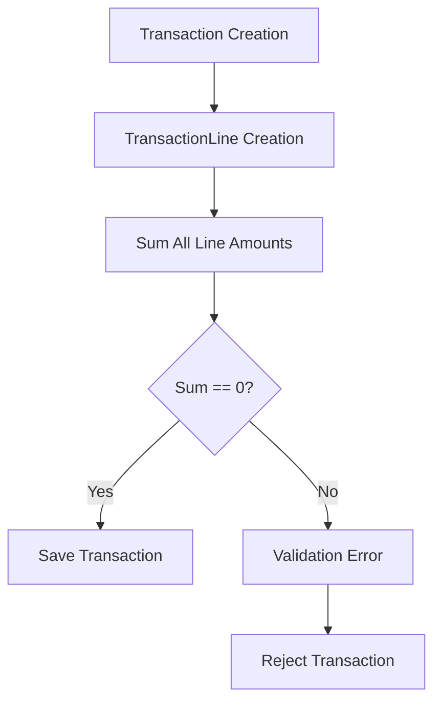
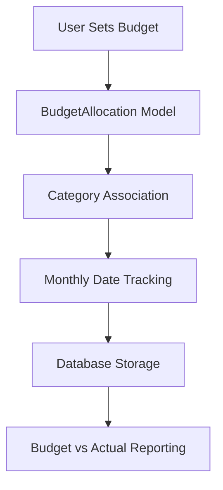

# FinanceBuddy Architecture

## 1. Overview

**Purpose**: Personal finance and budgeting application implementing double-entry bookkeeping principles
**Architecture Style**: Monolithic Rails application with MVC pattern
**Deployment Model**: Containerized with Docker, deployable via Kamal

## 2. Technology Stack

### Backend
- **Framework**: Ruby on Rails 8.0.4
- **Web Server**: Puma
- **Database**: PostgreSQL 17 with pgvector extension
- **Caching**: Solid Cache (database-backed)
- **Background Jobs**: Solid Queue (database-backed)
- **WebSockets**: Solid Cable (database-backed)

### Frontend
- **JavaScript Framework**: Stimulus.js (Hotwire)
- **Page Updates**: Turbo (Hotwire)
- **CSS**: Bootstrap SCSS with custom components
- **Asset Pipeline**: Propshaft
- **JavaScript Bundling**: Importmap

### Infrastructure
- **Containerization**: Docker with docker-compose
- **Deployment**: Kamal (Docker-based deployment tool)
- **Reverse Proxy**: Thruster (for asset caching/compression)
- **Session Storage**: Database-backed sessions

### Development Tools
- **Linting**: StandardRB with standard-rails
- **Testing**: Minitest with Capybara for system tests
- **Security**: Brakeman for static analysis
- **Debugging**: debug gem

## 3. Component Architecture

### Core Modules

#### Authentication & Authorization
- **Location**: `app/controllers/concerns/authentication.rb`, `app/models/current.rb`
- **Responsibilities**:
  - Session management with cookie-based authentication
  - User authentication flow
  - Current user/session context management
- **Key Components**:
  - `Authentication` concern (mixed into ApplicationController)
  - `Current` module for global access to current user/session
  - `Session` model for tracking user sessions

#### Ledger System
- **Location**: `app/models/ledger.rb`, `app/models/ledger_membership.rb`
- **Responsibilities**:
  - Multi-ledger support (users can belong to multiple ledgers)
  - Ledger-scoped data isolation
  - User roles and permissions within ledgers
- **Key Components**:
  - `Ledger` model (core container for financial data)
  - `LedgerMembership` model (user-ledger associations)
  - `Current.ledger` accessor for ledger context

#### Double-Entry Bookkeeping
- **Location**: `app/models/transaction_entry.rb`, `app/models/transaction_line.rb`
- **Responsibilities**:
  - Transaction recording with debit/credit balancing
  - Transaction validation and integrity
  - Support for multiple transaction types
- **Key Components**:
  - `TransactionEntry` model (header record, uses "transactions" table)
  - `TransactionLine` model (individual debit/credit entries)
  - Entry types: expense, income, transfer, opening_balance
  - Statuses: uncleared, cleared, reconciled

#### Account Management
- **Location**: `app/models/account.rb`, `app/controllers/accounts_controller.rb`
- **Responsibilities**:
  - Account creation and management
  - Balance tracking (current and cleared)
  - Account type classification
  - Reconciliation support
- **Key Components**:
  - `Account` model with account_type validation
  - Balance and cleared_balance tracking
  - Reconciliation date tracking

#### Budgeting System
- **Location**: `app/models/budget_allocation.rb`, `app/models/category.rb`, `app/controllers/budget_controller.rb`
- **Responsibilities**:
  - Monthly budget allocation
  - Category-based budgeting
  - Budget vs actual tracking
  - Category group organization
- **Key Components**:
  - `BudgetAllocation` model (monthly category budgets)
  - `Category` and `CategoryGroup` models
  - Account-specific categories
  - System-managed categories

#### Recurring Transactions
- **Location**: `app/models/recurring_transaction.rb`, `app/controllers/recurring_transactions_controller.rb`
- **Responsibilities**:
  - Scheduled transaction generation
  - Frequency-based recurrence (weekly, monthly, etc.)
  - Automatic transaction entry
  - Next due date calculation
- **Key Components**:
  - `RecurringTransaction` model
  - Frequency patterns and scheduling
  - Auto-entry functionality

#### Payee Management
- **Location**: `app/models/payee.rb`, `app/models/payee_rule.rb`
- **Responsibilities**:
  - Payee tracking and management
  - Automatic categorization rules
  - Pattern matching for transactions
- **Key Components**:
  - `Payee` model (transaction counterparts)
  - `PayeeRule` model (auto-categorization rules)
  - Exact and pattern-based matching

### Supporting Components

#### Current Context
- **Location**: `app/models/current.rb`
- **Responsibilities**:
  - Global access to current user, session, and ledger
  - Thread-safe request context
  - Simplified access in models and controllers

#### Background Jobs
- **Location**: `app/jobs/`
- **Responsibilities**:
  - Asynchronous task processing
  - Scheduled jobs
  - Database-backed queue system

#### WebSockets
- **Location**: `app/channels/`
- **Responsibilities**:
  - Real-time updates
  - Live data synchronization
  - Notification system

## 4. Data Flow Diagrams

### User Authentication Flow


### Transaction Processing Flow


### Double-Entry Validation Flow


### Budget Tracking Flow


## 5. Architectural Assessment

### Design Patterns

**Positive Patterns:**
- **Double-Entry Bookkeeping**: Ensures financial data integrity through balanced transactions
- **Ledger-Scoped Data**: Clear data isolation between different ledgers
- **Concern-based Authentication**: Clean separation of authentication logic
- **Current Context Pattern**: Simplified access to request-scoped data
- **Hotwire Integration**: Efficient page updates without full SPA complexity

**Areas for Improvement:**
- **Monolithic Architecture**: Could benefit from modularization for larger scale
- **Database-backed Services**: Solid Queue/Cable add database load for non-critical operations
- **Limited API Layer**: Primarily UI-focused with minimal API endpoints

### Scalability Characteristics

**Strengths:**
- PostgreSQL with pgvector provides robust data storage and search capabilities
- Containerized deployment allows for horizontal scaling
- Database-backed services simplify deployment but may limit scalability
- Hotwire reduces frontend complexity and bandwidth requirements

**Concerns:**
- Database-backed queue system (Solid Queue) may become bottleneck under heavy load
- Monolithic architecture limits independent scaling of components
- Session data stored in database increases read/write load

### Performance Considerations

**Optimizations:**
- Indexed foreign keys for efficient joins
- Denormalized balance tracking in accounts
- Turbo for efficient page updates
- Thruster for asset caching and compression

**Potential Bottlenecks:**
- Complex transaction queries with multiple joins
- Budget reporting queries across time periods
- Recurring transaction scheduling queries

### Maintenance Challenges

**Current Challenges:**
- CI test environment lacks pgvector extension (mentioned in CLAUDE.md)
- Database-backed services increase maintenance complexity
- Monolithic structure may make large refactorings difficult

**Mitigations:**
- Comprehensive test suite with Minitest
- StandardRB linting for code consistency
- Brakeman for security vulnerability detection
- Docker-based development environment for consistency

## 6. Key Design Decisions

### Double-Entry Bookkeeping
**Decision**: Implement full double-entry accounting with transaction lines that must sum to zero
**Rationale**:
- Ensures financial data integrity
- Follows accounting best practices
- Prevents unbalanced transactions
- Supports complex transaction types (transfers, splits)

**Trade-offs**:
- Increased complexity for simple transactions
- More database records per transaction
- Additional validation logic required

### Ledger-Scoped Data
**Decision**: All financial data belongs to a ledger, accessed via ledger memberships
**Rationale**:
- Supports multi-user collaboration
- Clear data isolation between different financial entities
- Flexible permission model
- Enables shared ledgers for families/businesses

**Trade-offs**:
- Additional join required for most queries
- More complex data setup for new users
- Ledger switching UI complexity

### Hotwire over SPA Framework
**Decision**: Use Hotwire (Turbo + Stimulus) instead of React/Vue SPA
**Rationale**:
- Simpler development model
- Better Rails integration
- Reduced JavaScript complexity
- Faster page loads with server rendering
- Lower bandwidth requirements

**Trade-offs**:
- Less interactive than full SPA
- Limited client-side state management
- Reduced offline capabilities

### Database-Backed Services
**Decision**: Use Solid Cache, Solid Queue, and Solid Cable instead of Redis
**Rationale**:
- Simplified deployment (no Redis dependency)
- Consistent with Rails 8 defaults
- Easier development setup
- Database transaction consistency

**Trade-offs**:
- Reduced performance for high-volume operations
- Increased database load
- Limited horizontal scaling options

### String Enums
**Decision**: Use string-based enums instead of integer-based enums
**Rationale**:
- More readable in database and logs
- Self-documenting values
- Easier to understand in queries
- Avoids magic numbers

**Trade-offs**:
- Slightly more storage space
- Additional validation required
- Migration complexity if values change

## 7. Getting Started Guide

### Development Setup
```bash
docker compose up -d          # Start PostgreSQL and Redis
bin/rails db:prepare           # Create and migrate database
bin/rails test                 # Run tests
bin/rubocop                    # Run linter
bin/dev                        # Start development server
```

### Key Concepts for New Developers
1. **Ledger Context**: Most operations require a current ledger (set via `Current.ledger`)
2. **Double-Entry**: All transactions must have lines that sum to zero
3. **Hotwire**: UI updates happen via Turbo streams, not JavaScript frameworks
4. **Authentication**: Uses cookie-based sessions with `Current` context
5. **Database Services**: Cache, jobs, and WebSockets use database-backed implementations

### Common Query Patterns
```ruby
# Ledger-scoped queries
Current.ledger.accounts.where(account_type: "checking")

# Transaction with lines (double-entry)
transaction = TransactionEntry.create!(date: Date.today, entry_type: "expense")
transaction.transaction_lines.create!(account: checking, amount: -100)  # debit
transaction.transaction_lines.create!(account: expenses, amount: 100)   # credit

# Budget vs actual reporting
budget = BudgetAllocation.where(month: Date.today.beginning_of_month)
actual = TransactionLine.where(account: category.account)
  .where("date >= ? AND date <= ?", month.beginning_of_month, month.end_of_month)
```

## 8. Glossary and Acronyms

**Double-Entry Bookkeeping**: Accounting system where every transaction has equal debit and credit entries that sum to zero

**Ledger**: Container for all financial data, isolated from other ledgers

**Transaction Entry**: Header record for a financial transaction (uses "transactions" table)

**Transaction Line**: Individual debit or credit entry within a transaction

**Payee**: Entity receiving payment in a transaction

**Payee Rule**: Automatic categorization rule based on payee patterns

**Hotwire**: Combination of Turbo (page updates) and Stimulus (JavaScript controllers)

**Solid Services**: Database-backed implementations of cache, queue, and cable services

**pgvector**: PostgreSQL extension for vector similarity search

**Kamal**: Docker-based deployment tool

**Thruster**: Reverse proxy for asset caching and compression